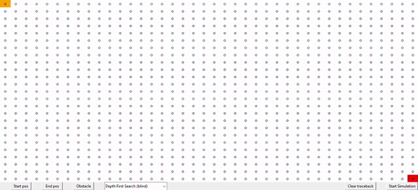
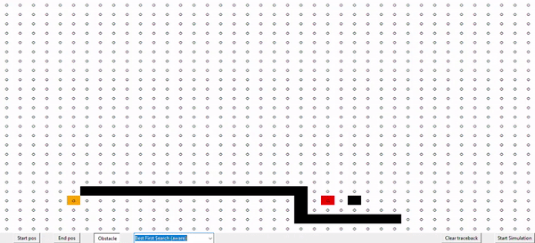

# Searching Algorithms

This is a simple and illustrative implementation of multiple searching algorithms that can be visualized.

### Dependencies

- Python 3.6+ 

No external libreries required.

### Algorithms

- Depth First Search: blind, not optimal
- Breadth First Search: blind, optimal
- Iterative DFS: blind, optimal
- Best First Search (greedy): aware, not optimal
- A Star: aware, optimal

Blind algorithms are not aware of the final cell position (a.k.a uninformed search algorithms), whereas aware algorithms
do know the final cell position so they can use that information (a.k.a informed search algorithms).

All implementations are isolated from the grid implementation so the code is pretty easy to follow. You can check
them in the [algorithms.py](algorithms.py) file. 

### Examples

Configure the grid and use Breadth first search:

Compare Best first search versus A*:

